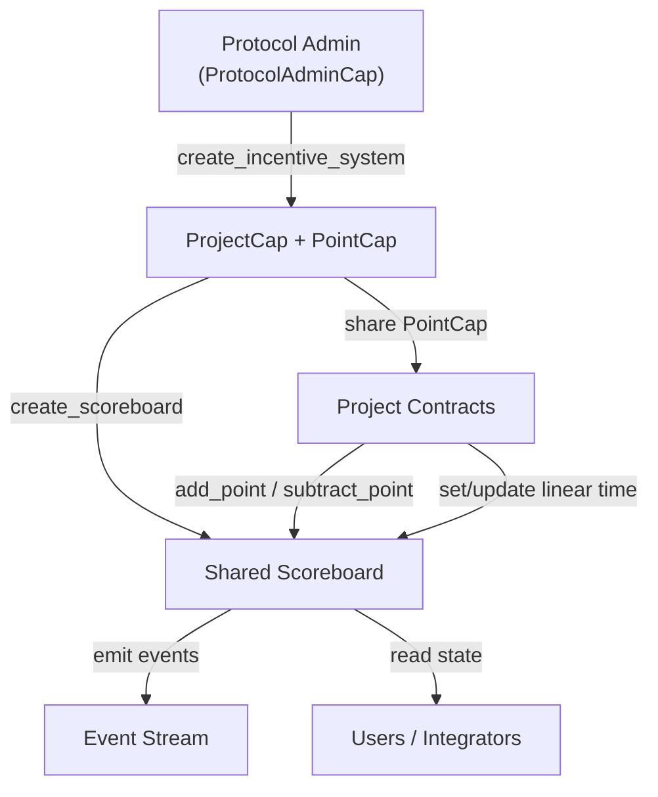

# LiquidLink v2 Incentive Contract Design (Cap-based, Draft)

Scope: on-chain scoring updated directly by authorized project contracts via capability objects (cap/borrow), optional time-weighted mechanics using integer math, multi-SKU redemption into restricted vouchers (non-coin), public verification via on-chain state (events are audit/logging only), modular architecture with an optional upgrade surface.

## Assumptions

- Platform: Move (Sui/IOTA), integer math only.
- Time source: blockchain timestamp (milliseconds) via `Clock` where available.
- Units: pure integers; if finer granularity is needed later, scale by a fixed factor (e.g., 1e6).
- No reverse redemption; vouchers are consumable and non-free-transfer.

## Roles

- Admin (LiquidLink): grants project capabilities, manages SKU catalog, emergency controls.
- Project(s): on-chain contracts that hold a project capability, create their own scoreboard, and update points within user transactions (no off-chain indexer required).
- Any user: can read/verify points from on-chain state; can redeem if they have points.
- Observers: can index events for analytics/audits, but events are not required to derive state.

## Authorization Model (cap/borrow)

- `ProtocolAdminCap` is minted at publish/init and owned by the protocol admin.
- A `Scoreboard` is a shared object that stores point-related state and a `project_id`.
- Admin grants a project a `ProjectCap`, and issues a `PointCap` bound to the same `project_id`.
- The project creates its own `Scoreboard` using `ProjectCap`, which writes the same `project_id` into the scoreboard.
- Every mutation must assert `cap.project_id == scoreboard.project_id` to prevent cross-project misuse.

## Modules (current repo layout; may evolve)

- `scoreboard`: `Scoreboard` storage + admin caps and constructors.
- `config`: capability helpers (e.g., `PointCap`) and optional scoring config.
- `mutate`: point mutations requiring `PointCap` and a mutable borrow of `Scoreboard`.
- (planned) `redeem`: reward SKU registry + voucher issuance/burning.
- (optional) `router`: upgrade surface if the package needs version routing.

## Data Structures (conceptual)

```move
struct Scoreboard has key {
    id: UID,
    project_id: ID,
    score: Table<address, u64>,
    stake: Table<address, u64>,
    timestamp: Table<address, u64>,
    // (planned) rewards/vouchers tables
}

struct ProtocolAdminCap has key, store { id: UID }

struct ProjectCap has key, store {
    id: UID
}

struct PointCap has key, store {
    id: UID,
    project_id: ID, // binds capability to a project
}
```

## Entry Interfaces (cap-based)

Admin:

- `create_incentive_system(protocol, client)` → issues `ProjectCap` + `PointCap` to `client`.

Project (authorized by cap):

- `create_scoreboard(project_cap, kind)` → creates and shares a `Scoreboard` bound to the project.
- `add_point(point_cap, scoreboard, amount)` → add points to the transaction sender (or a target if an extended API is added later).
- `subtract_point(point_cap, scoreboard, amount)` → subtract/clamp points for the transaction sender.
- `set_linear_time_point(point_cap, scoreboard, score_per_duration, duration, clock)` / `update_linear_time_point(...)` → optional linear-time scoring.

Public:

- `get_points(scoreboard, owner, now)` (view) → returns current points (and any time-weighted derived value) without writing state.

Redeem (planned):

- `register_reward(...)`, `update_reward(...)` (admin)
- `redeem(scoreboard, sku_id, amount)` (user) → deduct points, mint a restricted voucher.

## Events (logging only)

Emit events on:

- scoreboard creation / capability issuance & revocation
- point mutations (add/subtract/linear-time set/update)
- reward SKU changes and redemption

Events are for audit/indexing only; `Scoreboard` state is the source of truth.

## Invariants & Checks

- Capability authorization: only holders of the correct cap can mutate a scoreboard.
- Binding check: cap `project_id` must match the scoreboard being mutated.
- Points must not underflow (default: clamp at 0).
- (if enabled) linear-time score updates must be deterministic and verifiable.

## Open Decisions

- Whether negative balances are allowed vs clamp-to-0.
- Whether to encode per-project quotas/time windows in `ProjectCap` or in `Scoreboard` storage.
- Exact time-weighted formula (stake-based vs rate-based) and what is verifiable on-chain.

## Flowchart


